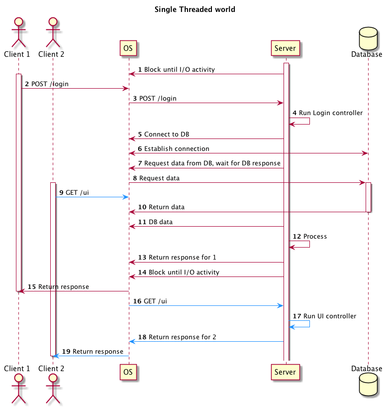
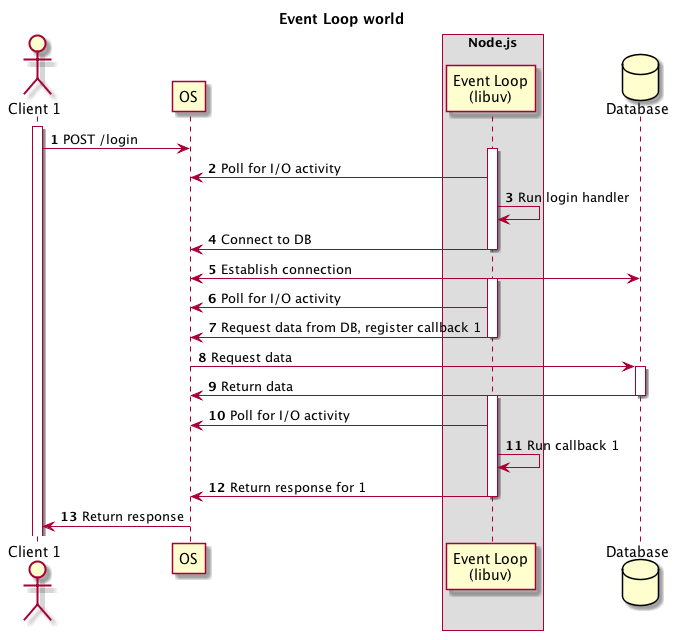
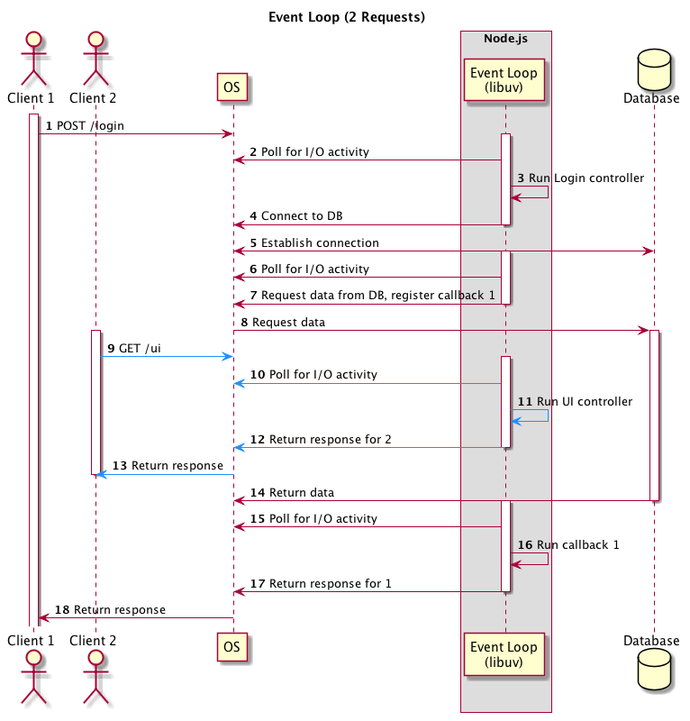

# Javascript Deep Dive: Event Loop

---

> If Javascript is single-threaded, how are asynchronous operations executed?

---

## Components

...

### Engine
- Interprets/Compiles and executes Javascript code
    - V8 (Chrome, Node.js)
    - SpiderMonkey (Firefox)
    - Chakra (Edge)
    - JavaScriptCore (Safari)

...

### Host Environment
- Provides additional objects and functions on top of the Javascript language core
- Browser, server, smartwatch etc.

...

#### Web APIs (Browsers)
- [APIs provided by the browser](https://developer.mozilla.org/en-US/docs/Web/API) as globals
    ```js
    //Timers
    setTimeout(() => {/* do something */}, 1000)
    //HTTP Request
    fetch('http://example.com')
    //DOM
    document.getElementsByName('div')
    ```

...

#### Modules (Node.js)
- [APIs provided by Node.js](https://nodejs.org/api/) as globals or Javascript modules (`require`d)
    ```js
    //Timers
    setTimeout(() => {/* do something */}, 1000)
    //Networking
    http.request('http://example.com')
    //File System I/O
    fs.readFile('output.txt')
    ```

---

## How does asynchronicity work?

- Javascript code runs in a single thread
- Anything asynchronous (timers, I/O) handled by Web APIs/Node.js modules
- Asynchronous I/O in Node.js using [libuv](https://libuv.org/)
    - Polling for I/O events using
        - [epoll](https://en.wikipedia.org/wiki/Epoll) (Linux)
        - [kqueue](https://www.freebsd.org/cgi/man.cgi?query=kqueue&sektion=2) (FreeBSD/OSX)
        - [IOCP](https://docs.microsoft.com/en-us/windows/win32/fileio/i-o-completion-ports) (Windows)

...


[](media/js-event-loop/single-threaded.png)

...

[](media/js-event-loop/event-loop.png)

...

[](media/js-event-loop/event-loop-2.png)

---

## So what?
- [Don't block the event loop](https://nodejs.org/en/docs/guides/dont-block-the-event-loop/)
    - Make use of callbacks/async as much as possible
    - Functions should be short
    - Computationally-expensive code should be offloaded to a different process/thread

---

## Try it out
http://latentflip.com/loupe

---

## References
- [[YouTube] What the heck is the event loop anyway? | Philip Roberts | JSConf EU](https://www.youtube.com/watch?v=8aGhZQkoFbQ)
- [[StackOverflow] How, in general, does Node.js handle 10,000 concurrent requests?](https://stackoverflow.com/a/34857298/4469613)
- [[libuv] Design Overview](http://docs.libuv.org/en/v1.x/design.html)
- [[Blog] How the Node.js Event Loop Polls](https://www.alexhwoods.com/blog/event-loop-polling)
- [[Tutorial] Browser environment, specs](https://javascript.info/browser-environment)
